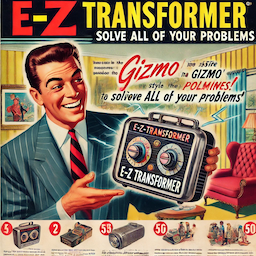

<p align="left">
  
  <br />
</p>

EZTransformer is a Transformer implementation that allows you to train translation models with simple API calls. 

* Dependencies: PyTorch (>= 2.0), tqdm (pandas optional: `return_history=True` returns a DataFrame if installed, otherwise a list of dicts)
* Runs on CPU, Apple MPS, and CUDA (bf16 mixed precision is enabled automatically on capable NVIDIA GPUs)
* Model: pre-norm encoder-decoder Transformer with RMSNorm, SwiGLU feed-forward layers, rotary position embeddings (RoPE), tied decoder input/output embeddings, and a KV cache for fast greedy or beam-search decoding

## Quickstart

```python3
from eztr import EZTransformer
import pickle

# Have data
mydata = pickle.load(open("data/sigmorphon2016spanish.p", "rb")) # Example word inflection data for Spanish

# Data format (whitespace-separated tokens, two-tuples for input/target)
>>> mydata['train'][:5]

[('a b a b o l # N PL', 'a b a b o l e s'),
 ('á b a c o # N SG', 'á b a c o'),
 ('a b a c o r a r # V IND PRS 1 PL IPFV/PFV', 'a b a c o r a m o s'),
 ('a b a c o r a r # V IND PRS 3 PL IPFV/PFV', 'a b a c o r a n'),
 ('a b a d e r n a r # V COND 1 PL', 'a b a d e r n a r í a m o s')]


# Initialize model
trf = EZTransformer(device = 'cuda')  # Change device as needed; 'cuda' (NVIDIA), 'mps' (Apple), or 'cpu'

# Train model
trf.fit(mydata['train'], valid_data = mydata['valid'], print_validation_examples = 2, max_epochs = 100)

# After fit(), trf holds the weights from the best validation epoch (restore_best=True).
# The best model is also written to best_model.pt and can be loaded back later:
trf = EZTransformer(load_model = "best_model.pt")

# Make Predictions
>>> trf.predict(["c o m p r o m e t e r # V IND PST 3 PL PFV", "h a b l a r # V IND PST 1 SG IPFV"])
   ['c o m p r o m e t i e r o n', 'h a b l a b a']

# Beam search
trf.predict(["h a b l a r # V IND PST 1 SG IPFV"], beam_size = 5)

# Evaluate on test set
trf.score(mydata['test_inputs'], mydata['test_targets'])
trf.score(mydata['test_inputs'], mydata['test_targets'], beam_size = 5)
```

## Options

All options are keyword arguments to `EZTransformer(...)`; unknown names raise an error.

| Argument | Default | Description |
|---|---|---|
| `eed`, `ded` | 256 | Encoder / decoder embedding dimension (may differ) |
| `ehs`, `dhs` | 1024 | Encoder / decoder SwiGLU hidden size |
| `enl`, `dnl` | 4 | Encoder / decoder layers |
| `eah`, `dah` | 4 | Encoder / decoder attention heads |
| `use_rope` | True | Rotary position embeddings; `False` uses additive sinusoidal encodings |
| `rope_theta` | 10000.0 | RoPE base frequency |
| `drp` | 0.3 | Dropout |
| `bts` | 800 | Batch size (batches are bucketed by length) |
| `lrt` | 0.001 | Peak learning rate |
| `wup` | 0.05 | Linear warmup as a fraction of total steps, followed by cosine decay to 10% of `lrt` |
| `lst` | 0.1 | Label smoothing |
| `cnm` | 1.0 | Gradient clip norm |
| `optimizer` | `"adam"` | `"adam"` or `"adamw"` |
| `adam_betas` | (0.9, 0.999) | Adam betas |
| `max_pred_len` | None | Maximum output length; None means `max(50, 2 * source length + 10)` |
| `device` | auto | `"cuda"`, `"mps"`, or `"cpu"` (auto picks the first available) |
| `amp` | `"auto"` | Mixed precision: `"auto"` (bf16 on capable CUDA), `"bf16"` (force, e.g. to try on MPS), or `None` |
| `save_best` | True | Save the best model (by validation loss) to `best_model_file` |
| `best_model_file` | `"best_model.pt"` | Where to save the best model |
| `restore_best` | True | At the end of `fit()`, keep the best validation weights instead of the last |
| `compile_model` | False | Use `torch.compile` for training |
| `seed` | None | Random seed |
| `load_model` | None | Checkpoint to load |

When loading a checkpoint, the architecture (`eed` ... `dah`, `use_rope`, `rope_theta`) always comes from the checkpoint; passing a conflicting value is an error. Training settings (`lrt`, `drp`, `bts`, ...) come from the checkpoint unless you pass them explicitly, e.g. `EZTransformer(load_model="best_model.pt", lrt=1e-4)` to continue training at a lower learning rate. Checkpoints from earlier versions of eztr (before the custom Transformer layers) cannot be loaded.
